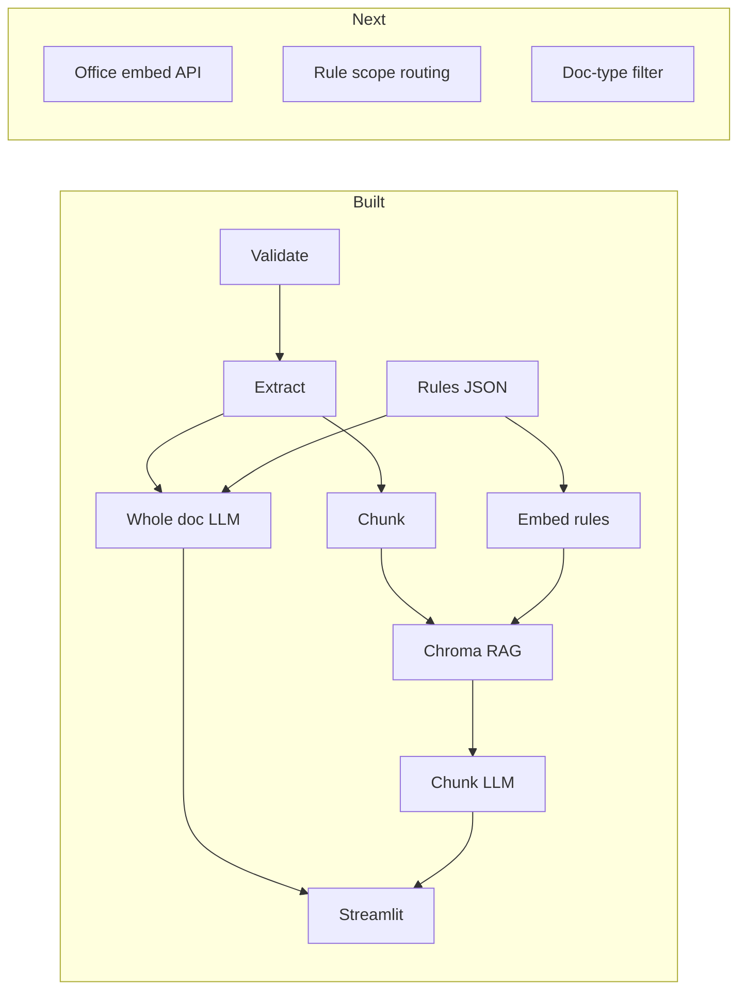

# Document Reviewer — Flow Document

End-to-end flow for GDP document compliance: inputs, processing steps, two compliance modes, RAG, outputs, configuration, and roadmap.

> **Quick commands:** [CHEATSHEET.md](../CHEATSHEET.md)

---

## 1. Overview

The system validates an uploaded document (PDF, DOCX, or TXT), extracts text (native or OCR), and checks it against 13 GDP rules using an LLM.

**Two compliance paths:**

```
                    ┌─────────────────────────────────────┐
                    │         Validate + Extract          │
                    └─────────────────┬───────────────────┘
                                      │
              ┌───────────────────────┴───────────────────────┐
              │                                               │
              ▼                                               ▼
   ┌──────────────────────┐                    ┌──────────────────────────┐
   │  Flow 1: whole_doc   │                    │  Flow 2: chunk_rag       │
   │  full_text + all 13  │                    │  chunk → Chroma match    │
   │  rules → 1 LLM call  │                    │  → per-chunk LLM → merge │
   └──────────┬───────────┘                    └────────────┬─────────────┘
              │                                             │
              └──────────────────┬──────────────────────────┘
                                 ▼
                        Compliance Report JSON
```

**Entry points:**

| Entry | What it runs |
|-------|--------------|
| `run_whole_doc_check.py` | Flow 1 end-to-end |
| `run_chunk_rag_check.py` | Flow 2 end-to-end |
| `streamlit_app.py` | UI — both flows |
| `main.py` | Validate → extract → chunk only (no compliance) |
| `src/compliance_pipeline.py` | Shared pipeline used by scripts + UI |

---

## 2. Inputs

| Input | Location | Required | Description |
|-------|----------|----------|-------------|
| **Document** | Upload / CLI path | Yes | PDF, DOCX, or TXT |
| **Validation config** | `config/validation.json` | Yes | Size, type, error messages |
| **Compliance config** | `config/compliance.json` | Yes for RAG | Top-k, prompts, always-include rules |
| **GDP rules** | `rules/rules.json` | Yes | 13 structured rules |
| **Rule vectors** | `data/chroma/` | Yes for chunk_rag | Created by `embed_rules.py` |
| **LLM credentials** | `.env` | For real LLM | Model Garden gateway |
| **Rules file upload** | Streamlit / `RULES_PATH` | Optional | Not fully wired; defaults to `rules.json` |

### Supported document types

| Extension | Form type | Native extractor | OCR |
|-----------|-----------|------------------|-----|
| `.pdf` | `pdf` | pdfplumber | EasyOCR via PyMuPDF |
| `.docx` | `docx` | python-docx | N/A |
| `.txt` | `text` | direct read | N/A |

---

## 3. Phase 0 — File Validation

**Script:** `scripts/validate_document.py`  
**Config:** `config/validation.json`  
**Output:** `output/validation/<stem>_<timestamp>_validation.json`

### Flow

```
Document path
      │
      ▼
File exists? → Supported type? → Size ≤ 50 MB? → Readable?
      │
      ▼
Native mode: text non-empty?
OCR mode:    PDF opens (empty native text OK)
      │
      ▼
✅ Validation passed  OR  ⚠️ stop pipeline
```

### Validation rules

| Rule | User message on failure |
|------|-------------------------|
| Unsupported file type | ⚠️ Unsupported file type. Please upload PDF, DOCX, or TXT files only. |
| File too large (>50 MB) | ⚠️ File is too large. Maximum supported size is 50MB. |
| Corrupt / unreadable | ⚠️ Could not read file. Please check it is not password-protected or corrupt. |
| Empty extraction (native) | ⚠️ Document appears to be empty or image-only. |
| Rules file empty | ⚠️ Could not extract rules… *(only when `enable_rules_file_validation: true`)* |

**If `valid` is false, the pipeline stops.**

---

## 4. Phase 1 — Text Extraction

**Script:** `scripts/extract_document.py`  
**Output:** `output/extracted/<stem>_<timestamp>_extracted.json`

### Native vs OCR

| Mode | Path | Use when |
|------|------|----------|
| `native` | pdfplumber / docx / txt | Digital PDFs with selectable text |
| `ocr` | PDF → PyMuPDF images → EasyOCR | Scanned / image-only PDFs |

**OCR config:** `config/ocr.json` — engine, languages, DPI, GPU, `fallback_to_page_chunks`.

### Output shape

```json
{
  "file_name": "...",
  "page_count": 10,
  "extraction_method": "native",
  "pages": [{ "page": 1, "text": "..." }],
  "full_text": "--- Page 1 ---\n..."
}
```

---

## 5. Phase 2 — Section Chunking

**Script:** `scripts/chunk_document.py`  
**Used by:** Flow 2 (chunk_rag), `main.py`, manual pipelines  
**Skipped by:** Flow 1 (whole_doc)

**Output:** `output/chunks/<stem>_<timestamp>_chunks.json`

### Chunking behavior

- Page 1 → single `first_page` chunk
- TOC → single `structure` chunk
- Splits on major headings (`REVISION HISTORY`, `1 INTRODUCTION`, etc.)
- Keeps approval and revision tables intact
- Appends `full_document` chunk (skipped in RAG matching)
- OCR with `fallback_to_page_chunks: true` → one chunk per page

### Section types

| `section_type` | Example |
|----------------|---------|
| `first_page` | Title block |
| `approval` | Signature / approval tables |
| `revision_history` | Revision table |
| `structure` | TOC, Introduction, References |
| `body` | General content |
| `footer` | Footer blocks when detected |
| `full` | Complete document copy |

---

## 6. Phase 3 — Rules

### 6a. Structured rules (default)

**File:** `rules/rules.json` — 13 GDP rules (GDP-01 to GDP-13)

| Field | Purpose |
|-------|---------|
| `rule_id` | Unique ID |
| `title`, `category`, `severity` | Metadata |
| `rule_type` | `deterministic` or `semantic` |
| `verifiable_criteria` | What to check |
| `recommendation` | Remediation |
| `applies_to_sections` | Which chunk types apply |

### 6b. Plain rules → JSON (Prompt 1, optional)

**Script:** `scripts/rules_from_text.py`  
**Prompt:** `prompts/rules_to_json.txt`  
**Output:** `output/rules/generated_rules.json`

Only needed when new rules arrive as plain text. The 13 GDP rules are already in JSON.

### 6c. Rule embedding (RAG setup, one-time)

**Script:** `scripts/embed_rules.py`  
**Module:** `src/rag/rule_store.py`  
**Output:** `data/chroma/` (Chroma collection `gdp_rules`)

```
rules.json
      │
      ▼
Build text per rule (title + criteria + category)
      │
      ▼
Embed with all-MiniLM-L6-v2 (local; office provider planned)
      │
      ▼
Upsert into Chroma (id = rule_id)
```

**When rules change:** edit `rules/rules.json`, rerun `python scripts/embed_rules.py` (or `--rebuild`).

---

## 7. Phase 4 — Compliance Check

**Module:** `src/compliance_pipeline.py`  
**Scripts:** `run_whole_doc_check.py`, `run_chunk_rag_check.py`, `check_compliance.py`  
**Output:** `output/reports/<stem>_<timestamp>_report.json`

### Flow 1 — Whole document

**Prompt:** `prompts/compliance_check_whole_doc.txt`  
**Config:** `config/compliance.json` → `whole_doc`

```
extracted.json (full_text)
      +
rules.json (all 13 rules)
      │
      ▼
One LLM call (dummy or Model Garden)
      │
      ▼
Report — one result per rule
```

- No chunking
- No RAG
- All 13 rules sent every time
- Best first test on office with real LLM

### Flow 2 — Chunk + RAG

**Prompt:** `prompts/compliance_check_chunk.txt`  
**Config:** `config/compliance.json` → `chunk_rag`

```
chunks.json
      │
      ▼
For each chunk (skip full_document):
  ├── Query Chroma → top_k rule IDs (default 5)
  ├── Add always_include: GDP-08, GDP-09, GDP-10
  └── Save matched rules per chunk
      │
      ▼
output/matches/<stem>_<timestamp>_chunk_rules.json
      │
      ▼
For each chunk: LLM(chunk text + matched rules only)
      │
      ▼
Merge across chunks → report
```

**Standalone match step:**

```powershell
python scripts/match_chunk_rules.py "output/chunks/your_chunks.json"
```

### LLM engines

| Engine | Flag / UI | Where |
|--------|-----------|-------|
| **Dummy** | `--llm dummy` / Streamlit "Dummy" | Local — keyword heuristics, no `.env` |
| **Model Garden** | `--llm model_garden` / Streamlit "Model Garden" | Office — real LLM via `.env` |

**Local vs office:**

| Component | Local (dev) | Office (prod test) |
|-----------|-------------|---------------------|
| Embeddings | MiniLM + Chroma | Office API *(planned)* |
| LLM | Dummy or Model Garden | Model Garden |

### Merge logic (chunk mode)

Priority: `failed` > `insufficient_evidence` > `not_applicable` > `passed`

- Any chunk **failed** on a rule → final **failed**
- Evidence from multiple chunks combined
- Rules never evaluated → **insufficient_evidence**

### Per-rule LLM output

```json
{
  "rule_id": "GDP-01",
  "status": "passed | failed | not_applicable | insufficient_evidence",
  "reason": "...",
  "evidence": "...",
  "confidence": 0.95
}
```

### Final report shape (chunk_rag)

```json
{
  "file_name": "...",
  "mode": "chunk_rag",
  "rule_retrieval": "rag",
  "chunk_rule_matches": {
    "top_k": 5,
    "always_include_rule_ids": ["GDP-08", "GDP-09", "GDP-10"],
    "matches": [
      {
        "chunk_id": "p1_1",
        "section_type": "first_page",
        "retrieved_rule_ids": ["GDP-10", "GDP-04", "..."],
        "matched_rule_ids": ["GDP-10", "GDP-04", "...", "GDP-08", "GDP-09"],
        "matched_rules": [ ... ]
      }
    ]
  },
  "summary": {
    "overall_status": "compliant | non_compliant | needs_review",
    "passed": 8,
    "failed": 3,
    "total_rules": 13
  },
  "chunk_outputs": [ ... ],
  "results": [ ... ],
  "extraction_mode": "native",
  "llm_engine": "dummy | model_garden"
}
```

---

## 8. Streamlit UI

**Run:** `python -m streamlit run streamlit_app.py`

```
Tab 1: Upload & Check
  ├── Document upload
  ├── Optional rules upload (JSON wired; TXT shows warning)
  ├── Extraction: native | ocr
  ├── Compliance: whole_doc | chunk_rag
  └── LLM: dummy | model_garden

Tab 2: Results & Metrics
  ├── Overall status + rule table
  ├── Chunk → matched rules (RAG mode)
  └── Download report JSON
```

Uploads saved to `output/uploads/<run_timestamp>/`.

---

## 9. Main Pipeline (`main.py`)

**Run:** `python main.py`

Edit at top of file:

```python
DOCUMENT_PATH = PROJECT_ROOT / "docs" / "your_document.pdf"
EXTRACTION_MODE = "native"  # or "ocr"
```

| Step | Action | Output |
|------|--------|--------|
| 1/3 | Validate | `output/validation/` |
| 2/3 | Extract | `output/extracted/` |
| 3/3 | Chunk | `output/chunks/` |

Compliance is **not** in `main.py` — use `run_whole_doc_check.py` or `run_chunk_rag_check.py`.

---

## 10. Full Command Sequences

### Setup (once)

```powershell
pip install -r requirements.txt
copy .env.example .env
python scripts/embed_rules.py --rebuild
```

### Flow 1 — whole doc

```powershell
python scripts/run_whole_doc_check.py "docs/Deployment Report_v0 - filled.pdf"
python scripts/run_whole_doc_check.py "docs/your_doc.pdf" --extraction ocr --llm model_garden
```

### Flow 2 — chunk + RAG

```powershell
python scripts/run_chunk_rag_check.py "docs/Deployment Report_v0 - filled.pdf"
python scripts/run_chunk_rag_check.py "docs/your_doc.pdf" --llm dummy
```

### Manual pipeline

```powershell
python main.py
python scripts/match_chunk_rules.py "output/chunks/your_chunks.json"
python scripts/check_compliance.py "output/chunks/your_chunks.json" --file-name "your_doc.pdf"
```

---

## 11. Output Folder Structure

```
output/
├── validation/     ← Pass/fail + error messages
├── extracted/      ← Page text + full_text
├── chunks/         ← Section chunks
├── matches/        ← Chunk → matched rules (RAG)
├── reports/        ← Final compliance reports
├── rules/          ← LLM-generated rules (optional)
└── uploads/        ← Streamlit uploads

data/
└── chroma/         ← Embedded rule vectors
```

All artifact filenames include a **run timestamp** — previous runs are never overwritten.

---

## 12. Configuration Files

| File | Purpose |
|------|---------|
| `config/validation.json` | File limits, types, messages, rules upload toggle |
| `config/compliance.json` | Embedding model, RAG top-k, prompt paths, always-include rules |
| `config/ocr.json` | EasyOCR settings, page-chunk fallback |
| `rules/rules.json` | 13 GDP rules |
| `prompts/compliance_check_whole_doc.txt` | Flow 1 LLM prompt |
| `prompts/compliance_check_chunk.txt` | Flow 2 LLM prompt |
| `prompts/compliance_check.txt` | Legacy CLI prompt |
| `prompts/rules_to_json.txt` | Prompt 1 — rules structuring |
| `.env` | Model Garden credentials |

### `config/compliance.json` defaults

```json
{
  "embedding_model": "all-MiniLM-L6-v2",
  "chroma_collection": "gdp_rules",
  "chunk_rag": {
    "top_k_rules_per_chunk": 5,
    "always_include_rule_ids": ["GDP-08", "GDP-09", "GDP-10"],
    "skip_chunk_ids": ["full_document"]
  }
}
```

---

## 13. Iteration Roadmap

| Iteration | Focus | Status |
|-----------|-------|--------|
| **Validation + extract + chunk** | Native + OCR paths | Done |
| **Iteration 2 — LLM compliance** | Whole doc + chunk modes, dummy + Model Garden | Done |
| **Iteration 3 — RAG** | Chroma embed, top-k per chunk, merge | Done (local MiniLM) |
| **Office embedding provider** | Swap local embed for office API | Planned |
| **Rules upload flow** | Plain rules → Prompt 1 → check | Planned |
| **Rule routing by scope** | Deterministic / chunk / whole-doc per rule | Planned |
| **Doc-type filtering** | 100 doc types × ~20 rules | Planned |
| **Iteration 1 — Regex** | Deterministic rules without LLM | Planned |



---

## 14. GDP Rules Summary

| Rule ID | Title | Type |
|---------|-------|------|
| GDP-01 | Document title matches file name | semantic |
| GDP-02 | Author name and role mentioned | semantic |
| GDP-03 | Revision history dates valid | deterministic |
| GDP-04 | Version in title and revision history | deterministic |
| GDP-05 | Revision section present | deterministic |
| GDP-06 | Signature blocks present | deterministic |
| GDP-07 | Dates near signatures | deterministic |
| GDP-08 | Font and spacing consistency | semantic |
| GDP-09 | Language errors | semantic |
| GDP-10 | Required sections present | semantic |
| GDP-11 | Page numbers sequential | deterministic |
| GDP-12 | Readability acceptable | semantic |
| GDP-13 | Footer has doc ID, page number, confidentiality | deterministic |

---

## 15. Key Design Decisions

1. **Validate before extract** — fail fast on bad uploads.
2. **Two compliance modes** — whole doc (all rules) vs chunk + RAG (scaled retrieval).
3. **Separate prompts** — whole-doc and chunk prompts differ; no single prompt for both.
4. **Local mock, office real** — dummy LLM + local MiniLM here; Model Garden + office embed there.
5. **Rules JSON schema is stable** — same shape across regex, LLM, and RAG phases.
6. **Timestamped outputs** — every run gets unique files under `output/`.
7. **Rules upload off by default** — uses `rules/rules.json` until upload flow is wired.
8. **Global rules caveat** — page numbers, grammar, full structure may need document-level checks beyond chunk RAG (future rule routing).

---

## 16. Known Issues

| Issue | Workaround |
|-------|------------|
| Dummy LLM empty chunk results | Chunk prompt uses `MATCHED RULES FOR THIS CHUNK:`; dummy parser looks for `RULES TO EVALUATE:`. Use whole_doc mode locally or Model Garden for chunk mode. |
| Chroma not portable across embed models | Re-run `embed_rules.py` on office with office embedding model. |
| Streamlit `streamlit` not on PATH (Windows) | Use `python -m streamlit run streamlit_app.py`. |

---

## 17. Error Handling Summary

| Stage | On failure |
|-------|------------|
| Validation | Pipeline stops; user sees ⚠️ from config |
| Extraction | Pipeline stops; empty text error |
| Chunking | Runs on whatever was extracted |
| RAG match | Error if Chroma empty — run `embed_rules.py` |
| Compliance | LLM errors per chunk; missing evidence → `insufficient_evidence` |

---

*Last updated: whole_doc + chunk_rag flows, Chroma RAG, Streamlit UI, local mock vs office provider split.*
